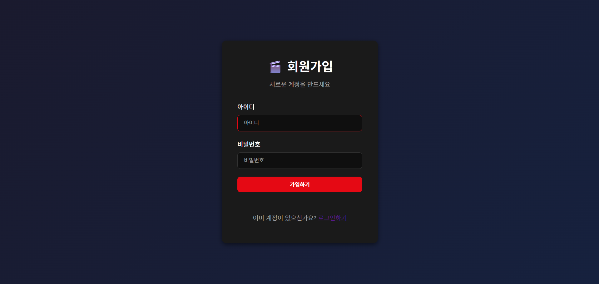
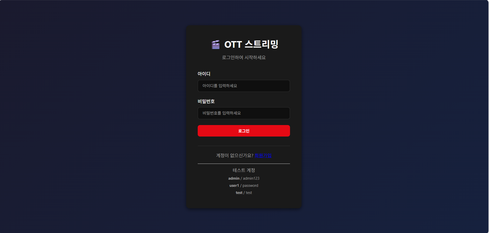
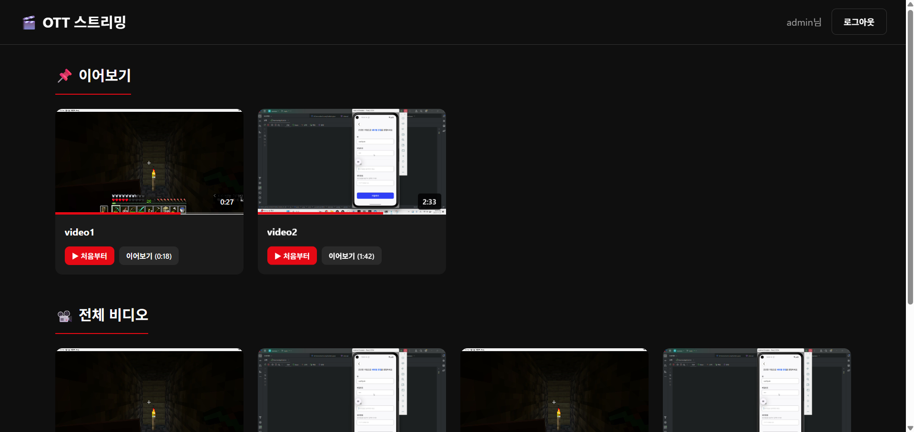
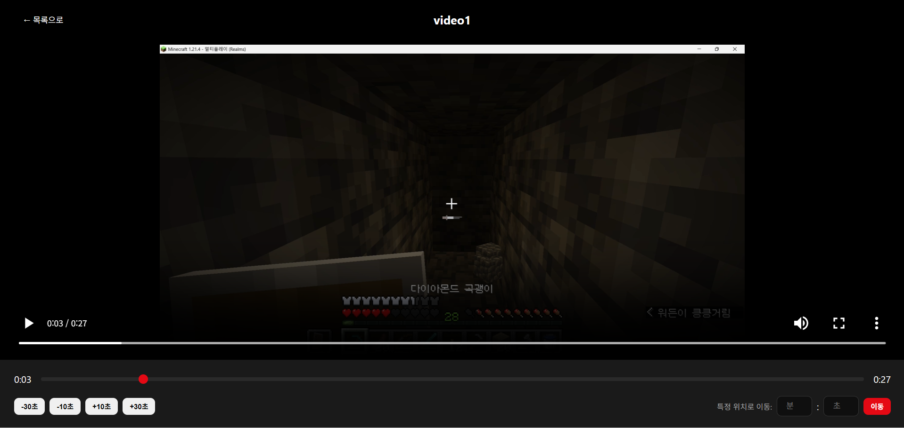

# 프로젝트 보고서

## 프로젝트명: OTT Video Streaming Server

C언어로 직접 구현한 HTTP 기반 비디오 스트리밍 서버이다. 외부 웹 프레임워크 없이 소켓 프로그래밍부터 HTTP 파싱, 데이터베이스 연동까지 모두 직접 구현하였다.

---

# 1. 시스템 구조도

## 1.1 전체 아키텍처

```
┌─────────────────────────────────────────────────────────────────────┐
│                           Client (Browser)                          │
│                    HTML5 Video Player + JavaScript                  │
└─────────────────────────────────────────────────────────────────────┘
                                    │
                                    │ HTTP/TCP (Port 8080)
                                    ▼
┌─────────────────────────────────────────────────────────────────────┐
│                         OTT Server (C)                              │
│                                                                     │
│   main.c ──→ http_handler.c ──→ db.c ──→ PostgreSQL                │
│      │                                                              │
│      └──→ Thread Pool (8 Workers)                                  │
│                                                                     │
└─────────────────────────────────────────────────────────────────────┘
                                    │
                                    │ libpq (Port 5432)
                                    ▼
┌─────────────────────────────────────────────────────────────────────┐
│                         PostgreSQL Database                         │
│         users / videos / sessions / watch_history                   │
└─────────────────────────────────────────────────────────────────────┘
```

서버는 메인 스레드에서 클라이언트 연결을 받아 큐에 넣고, 8개의 워커 스레드가 큐에서 연결을 꺼내 처리하는 구조이다. 이렇게 하면 동시에 여러 클라이언트를 처리할 수 있다.

---

# 2. 개발 보고서

## 2.1 개발환경 및 컴파일 환경

### 개발 환경

| 항목 | 내용 |
|------|------|
| 운영체제 | Windows 11 |
| 개발 도구 | Visual Studio 2022 Community |
| 언어 | C (C99 표준) |
| 데이터베이스 | PostgreSQL 15 |
| 버전 관리 | Git / GitHub |

### 컴파일 환경

프로젝트는 `build_vs.bat` 스크립트로 빌드한다. 내부적으로 Visual Studio의 `cl.exe` 컴파일러를 사용하며, 64비트 타겟으로 컴파일된다.

```batch
cl /c /O2 /W3 /I"src" src\main.c src\utils.c src\http_handler.c src\db.c
link /OUT:ott_server.exe main.obj utils.obj http_handler.obj db.obj ws2_32.lib libpq.lib
```

### 사용 라이브러리

| 라이브러리 | 용도 | 설명 |
|------------|------|------|
| ws2_32.lib | 네트워크 | Windows 소켓 API (WinSock2) |
| libpq | 데이터베이스 | PostgreSQL C 클라이언트 라이브러리 |

---

## 2.2 설계 명세서

### 소스 파일 구성

| 파일 | 라인 수 | 역할 |
|------|---------|------|
| main.c | 411 | 서버 진입점, 스레드 풀 관리 |
| http_handler.c | 598 | HTTP 요청 처리, 라우팅 |
| db.c | 433 | PostgreSQL 연동 |
| utils.c | 280 | 유틸리티 함수 |
| ffmpeg_helper.c | 250 | 썸네일 생성 |
| common.h | 158 | 공통 헤더, 구조체 정의 |

### 주요 자료구조

**common.h**에서 정의한 핵심 구조체들이다:

```c
/* 사용자 정보 */
typedef struct {
    int id;
    char username[64];
    char password_hash[256];
    int active;
} User;

/* 비디오 정보 */
typedef struct {
    int id;
    char title[256];
    char filename[256];
    char thumbnail[256];
    int duration_sec;
} Video;

/* 세션 정보 */
typedef struct {
    char token[65];
    int user_id;
    time_t expires_at;
} Session;

/* HTTP 요청 파싱 결과 */
typedef struct {
    char method[16];      // GET, POST
    char path[512];       // /login, /api/videos 등
    char cookie[512];     // 세션 토큰
    long range_start;     // Range 요청 시작
    long range_end;       // Range 요청 끝
    char body[4096];      // POST 데이터
} HttpRequest;
```

### 데이터베이스 스키마

PostgreSQL에 4개의 테이블을 생성한다. `sql/schema.sql` 파일에 정의되어 있다.

**users 테이블** - 사용자 계정

```sql
CREATE TABLE users (
    id SERIAL PRIMARY KEY,
    username VARCHAR(64) UNIQUE NOT NULL,
    password_hash VARCHAR(256) NOT NULL,
    active BOOLEAN DEFAULT TRUE
);
```

**videos 테이블** - 비디오 메타데이터

```sql
CREATE TABLE videos (
    id SERIAL PRIMARY KEY,
    title VARCHAR(256) NOT NULL,
    filename VARCHAR(256) UNIQUE NOT NULL,
    thumbnail VARCHAR(256),
    duration_sec INTEGER DEFAULT 0
);
```

**sessions 테이블** - 로그인 세션

```sql
CREATE TABLE sessions (
    id SERIAL PRIMARY KEY,
    user_id INTEGER REFERENCES users(id),
    token VARCHAR(64) UNIQUE NOT NULL,
    expires_at TIMESTAMP NOT NULL
);
```

**watch_history 테이블** - 시청 기록 (이어보기용)

```sql
CREATE TABLE watch_history (
    id SERIAL PRIMARY KEY,
    user_id INTEGER REFERENCES users(id),
    video_id INTEGER REFERENCES videos(id),
    last_pos_sec INTEGER DEFAULT 0,
    UNIQUE(user_id, video_id)
);
```

---

## 2.3 요구사항에 대한 구현 명세서

### 요구사항 충족 요약표

| 번호 | 요구사항 | 구현 | 구현 위치 |
|------|----------|------|-----------|
| 1 | 멀티스레드 서버 | ✓ | main.c |
| 2 | HTTP GET/POST | ✓ | http_handler.c |
| 3 | 비디오 스트리밍 | ✓ | stream_video() |
| 4 | Range 요청 | ✓ | stream_video() |
| 5 | 사용자 로그인 | ✓ | handle_login() |
| 6 | 회원가입 | ✓ | handle_register() |
| 7 | DB 연동 | ✓ | db.c (libpq) |
| 8 | 시청 기록 | ✓ | history_update() |
| 9 | 정적 파일 서빙 | ✓ | send_static_file() |
| 10 | 보안 (해시, SQL Injection 방지) | ✓ | 전체 |

---

## 2.4 요구사항에 대한 세부 설명서

### 2.4.1 멀티스레드 서버

서버가 동시에 여러 클라이언트를 처리하려면 멀티스레드가 필요하다. 이 프로젝트에서는 **Thread Pool** 패턴을 사용했다.

**main.c**에서 스레드 풀을 구성한다:

```c
#define THREAD_POOL_SIZE 8
#define MAX_QUEUE_SIZE 100

/* 연결 큐 - 스레드 간 작업 분배용 */
typedef struct {
    SOCKET sockets[MAX_QUEUE_SIZE];
    int front, rear, count;
    pthread_mutex_t mutex;
    HANDLE not_empty;
    HANDLE not_full;
} ConnectionQueue;
```

메인 스레드는 클라이언트 연결을 받아 큐에 추가하고, 워커 스레드들은 큐에서 꺼내 처리한다:

```c
/* 메인 스레드: 연결 수락 → 큐에 추가 */
while (g_running) {
    SOCKET client = accept(server_socket, ...);
    queue_push(&g_queue, client);
}

/* 워커 스레드: 큐에서 꺼내 처리 */
void* worker_thread(void* arg) {
    while (g_running) {
        SOCKET client = queue_pop(&g_queue);
        recv(client, buffer, ...);
        handle_request(client, buffer);
        closesocket(client);
    }
}
```

동기화를 위해 `CRITICAL_SECTION`(뮤텍스)과 `Event`(조건변수)를 사용한다.

### 2.4.2 HTTP 프로토콜 처리

HTTP 요청을 직접 파싱한다. **utils.c**의 `parse_http_request()` 함수가 담당한다:

```c
int parse_http_request(const char* raw, HttpRequest* req) {
    /* 첫 줄: GET /path HTTP/1.1 */
    sscanf(raw, "%s %s %s", req->method, req->path, req->version);
    
    /* Cookie 헤더 찾기 */
    char* cookie_line = strstr(raw, "Cookie:");
    if (cookie_line) {
        /* 세션 토큰 추출 */
    }
    
    /* Range 헤더 찾기 (비디오 스트리밍용) */
    char* range = strstr(raw, "Range: bytes=");
    if (range) {
        sscanf(range, "Range: bytes=%ld-%ld", &req->range_start, &req->range_end);
        req->has_range = 1;
    }
    
    return 0;
}
```

**http_handler.c**의 `handle_request()`에서 URL에 따라 적절한 핸들러로 분기한다:

```c
void handle_request(SOCKET client, const char* raw) {
    HttpRequest req;
    parse_http_request(raw, &req);
    
    if (strcmp(req.method, "POST") == 0) {
        if (strcmp(req.path, "/login") == 0) {
            handle_login(client, &req);
        } else if (strcmp(req.path, "/register") == 0) {
            handle_register(client, &req);
        }
    } else if (strcmp(req.method, "GET") == 0) {
        if (strncmp(req.path, "/video/", 7) == 0) {
            stream_video(client, video_id, &req, user_id);
        } else if (strcmp(req.path, "/api/videos") == 0) {
            api_get_videos(client, user_id);
        } else {
            send_static_file(client, req.path, &req);
        }
    }
}
```

### 2.4.3 비디오 스트리밍 (Range 요청)

HTML5 비디오 플레이어는 전체 파일을 한 번에 받지 않고, 필요한 부분만 요청한다. 이를 **HTTP Range Request**라고 한다.

클라이언트가 보내는 요청:
```
GET /video/1 HTTP/1.1
Range: bytes=0-1048575
```

서버가 보내는 응답:
```
HTTP/1.1 206 Partial Content
Content-Range: bytes 0-1048575/10485760
Content-Length: 1048576

(요청한 범위의 바이너리 데이터)
```

**http_handler.c**의 `stream_video()` 함수:

```c
void stream_video(SOCKET client, int video_id, HttpRequest* req, int user_id) {
    Video* video = video_find_by_id(video_id);
    
    /* 파일 열기 */
    FILE* fp = fopen(video_path, "rb");
    fseek(fp, 0, SEEK_END);
    long file_size = ftell(fp);
    
    /* Range 처리 */
    long start = req->range_start;
    long end = req->range_end ? req->range_end : file_size - 1;
    long content_length = end - start + 1;
    
    /* 206 Partial Content 응답 */
    char header[512];
    snprintf(header, sizeof(header),
        "HTTP/1.1 206 Partial Content\r\n"
        "Content-Type: video/mp4\r\n"
        "Content-Range: bytes %ld-%ld/%ld\r\n"
        "Content-Length: %ld\r\n\r\n",
        start, end, file_size, content_length);
    send(client, header, strlen(header), 0);
    
    /* 파일 데이터 전송 */
    fseek(fp, start, SEEK_SET);
    char buffer[65536];
    while (content_length > 0) {
        int to_read = (content_length < 65536) ? content_length : 65536;
        int bytes = fread(buffer, 1, to_read, fp);
        send(client, buffer, bytes, 0);
        content_length -= bytes;
    }
    fclose(fp);
}
```

### 2.4.4 사용자 인증

로그인 시 비밀번호를 평문으로 비교하면 보안에 취약하다. 이 프로젝트에서는 **DJB2 해시 알고리즘**을 사용한다.

**utils.c**:

```c
unsigned long simple_hash(const char* str) {
    unsigned long hash = 5381;
    int c;
    while ((c = *str++)) {
        hash = ((hash << 5) + hash) + c;  /* hash * 33 + c */
    }
    return hash;
}
```

로그인 처리 흐름 (**http_handler.c**):

```c
void handle_login(SOCKET client, HttpRequest* req) {
    char username[64], password[64];
    get_query_param(req->body, "username", username, sizeof(username));
    get_query_param(req->body, "password", password, sizeof(password));
    
    /* DB에서 사용자 조회 */
    User* user = user_find_by_username(username);
    if (!user) {
        send_redirect(client, "/login.html?error=invalid", NULL);
        return;
    }
    
    /* 비밀번호 검증 */
    if (!user_verify_password(user, password)) {
        send_redirect(client, "/login.html?error=invalid", NULL);
        return;
    }
    
    /* 세션 생성 */
    Session* session = session_create(user->id);
    
    /* 쿠키에 세션 토큰 저장 */
    char cookie[256];
    snprintf(cookie, sizeof(cookie), "session=%s; Path=/; HttpOnly", session->token);
    send_redirect(client, "/list.html", cookie);
}
```

### 2.4.5 데이터베이스 연동

PostgreSQL과의 통신은 **libpq** 라이브러리를 사용한다. SQL Injection 방지를 위해 **Parameterized Query**를 사용한다.

**db.c**:

```c
/* 파라미터화된 쿼리 실행 */
PGresult* db_query_params(const char* query, int nParams, const char* const* params) {
    return PQexecParams(g_conn, query, nParams, NULL, params, NULL, NULL, 0);
}

/* 사용자 조회 - SQL Injection 방지 */
User* user_find_by_username(const char* username) {
    const char* params[1] = { username };
    PGresult* result = db_query_params(
        "SELECT id, username, password_hash, active FROM users WHERE username = $1",
        1, params);  /* $1에 username이 안전하게 바인딩됨 */
    
    /* 결과 처리 */
    user.id = atoi(PQgetvalue(result, 0, 0));
    strncpy(user.username, PQgetvalue(result, 0, 1), sizeof(user.username));
    ...
    return &user;
}
```

### 2.4.6 시청 기록 (이어보기)

사용자가 비디오를 시청하면, 클라이언트(JavaScript)에서 5초마다 현재 재생 위치를 서버로 전송한다. 다음에 같은 비디오를 열면 마지막 위치부터 재생된다.

**db.c**의 `history_update()`:

```c
int history_update(int user_id, int video_id, int position) {
    char user_str[16], video_str[16], pos_str[16];
    snprintf(user_str, sizeof(user_str), "%d", user_id);
    snprintf(video_str, sizeof(video_str), "%d", video_id);
    snprintf(pos_str, sizeof(pos_str), "%d", position);
    
    const char* params[3] = { user_str, video_str, pos_str };
    
    /* UPSERT: 있으면 UPDATE, 없으면 INSERT */
    PGresult* result = db_query_params(
        "INSERT INTO watch_history (user_id, video_id, last_pos_sec) "
        "VALUES ($1, $2, $3) "
        "ON CONFLICT (user_id, video_id) DO UPDATE SET last_pos_sec = $3",
        3, params);
    
    return (PQresultStatus(result) == PGRES_COMMAND_OK) ? 0 : -1;
}
```

---

# 3. 주요 함수 설명

## main.c

| 함수 | 설명 |
|------|------|
| main() | 서버 초기화, 소켓 생성, 스레드 풀 생성, accept 루프 |
| queue_init() | 연결 큐 초기화 |
| queue_push() | 큐에 클라이언트 소켓 추가 |
| queue_pop() | 큐에서 소켓 꺼내기 (블로킹) |
| worker_thread() | 워커 스레드 함수 |

## http_handler.c

| 함수 | 설명 |
|------|------|
| handle_request() | URL에 따라 핸들러 분기 |
| handle_login() | 로그인 처리 |
| handle_register() | 회원가입 처리 |
| stream_video() | 비디오 스트리밍 (Range 지원) |
| api_get_videos() | 비디오 목록 JSON 반환 |
| send_static_file() | HTML, CSS, JS 등 정적 파일 전송 |

## db.c

| 함수 | 설명 |
|------|------|
| data_init() | PostgreSQL 연결 |
| user_find_by_username() | 사용자 조회 |
| user_verify_password() | 비밀번호 검증 |
| user_create() | 신규 사용자 생성 |
| session_create() | 로그인 세션 생성 |
| history_update() | 시청 기록 저장 |

---

# 4. 구현 기능 및 테스트 결과

## 4.1 테스트 결과 요약

| 테스트 항목 | 방법 | 결과 |
|-------------|------|------|
| 로그인 | admin/admin123 입력 | 성공 |
| 회원가입 | 신규 계정 생성 | 성공 |
| 비디오 재생 | 목록에서 비디오 클릭 | 성공 |
| 탐색(Seek) | 재생 바 드래그 | 성공 |
| 이어보기 | 중간 종료 후 재접속 | 성공 |
| 동시 접속 | 여러 브라우저 탭 | 성공 |

## 4.2 테스트 상세

### 회원가입 테스트
1. 브라우저에서 `http://localhost:8080/register.html` 접속
2. 새 계정 정보 입력
3. 결과: 로그인 페이지로 이동



### 로그인 테스트
1. 브라우저에서 `http://localhost:8080` 접속
2. admin / admin123 입력
3. 결과: 비디오 목록 페이지로 이동



### 비디오 목록 화면
1. 로그인 후 비디오 목록 확인
2. 썸네일, 제목, 재생시간 표시



### 비디오 스트리밍 테스트
1. 비디오 클릭
2. 재생 시작 확인
3. 중간 지점으로 탐색
4. 결과: 정상 재생



### 이어보기 테스트
1. 비디오 30초 지점까지 시청
2. 브라우저 종료
3. 재접속 후 같은 비디오 선택
4. 결과: 30초 지점부터 재생

---

# 5. 팀원 담당 업무 및 기여도

혼자서 진행하였습니다!

**상세 업무**:
- 시스템 아키텍처 설계
- 멀티스레드 서버 구현
- HTTP 프로토콜 파서 구현
- PostgreSQL 연동
- 프론트엔드 (HTML/CSS/JS)
- 테스트 및 디버깅

---

# 6. 소스코드 목록

| 파일 | 라인 | 크기 |
|------|------|------|
| src/main.c | 411 | 11KB |
| src/http_handler.c | 598 | 18KB |
| src/db.c | 433 | 14KB |
| src/utils.c | 280 | 9KB |
| src/ffmpeg_helper.c | 250 | 8KB |
| src/common.h | 158 | 4KB |
| sql/schema.sql | 53 | 2KB |
| static/login.html | 66 | 3KB |
| static/list.html | 150 | 6KB |
| static/player.html | 200 | 10KB |
| **합계** | **약 2,600줄** | |
